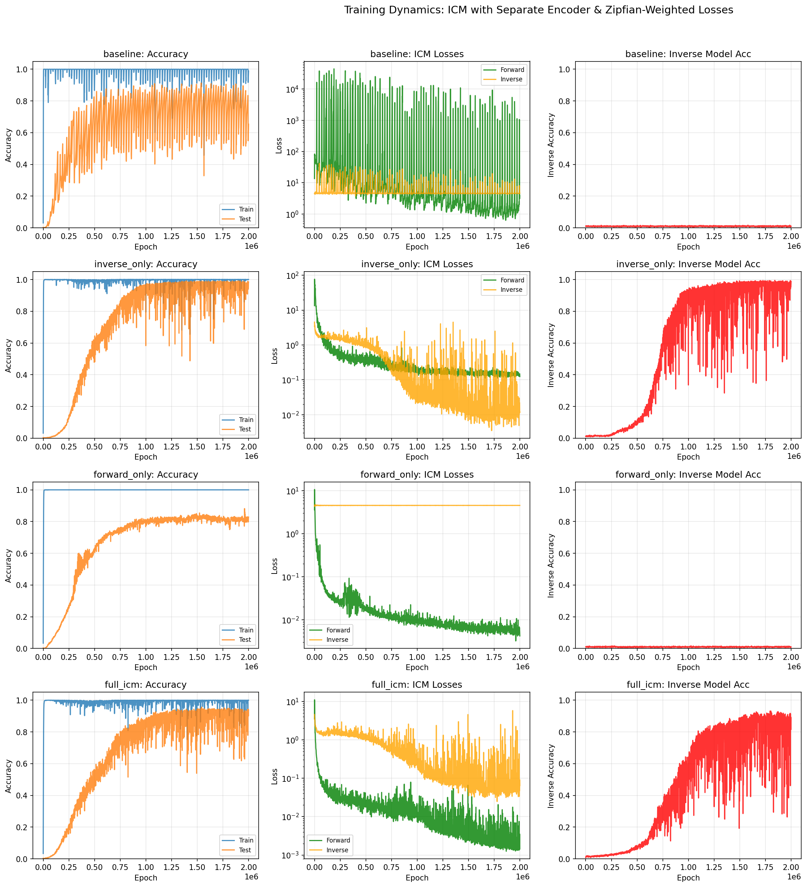
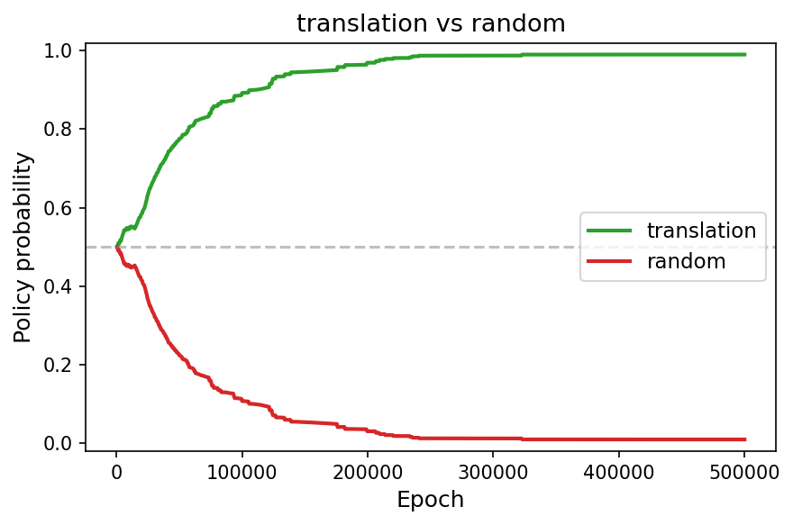
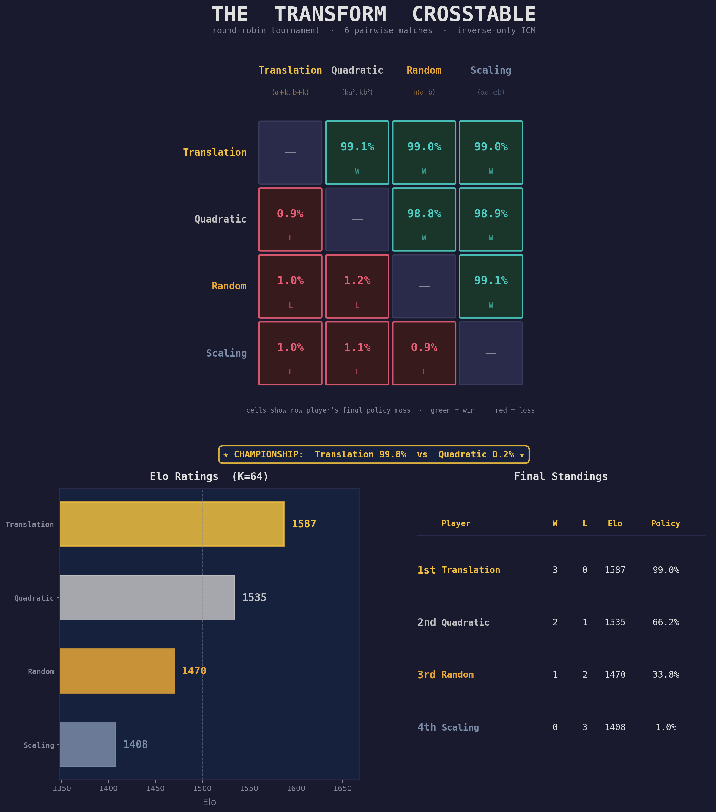
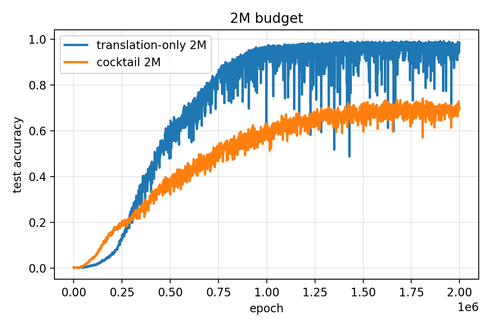

# Interaction as supervision

In the [previous essay in this series](https://jagilley.github.io/zipfian-grokking.html), we introduced the toy problem of Zipfian grokking: modify the data distribution of a modular arithmetic grokking[^1] run to follow Zipf's Law, and you get perpetual un-grokking and re-grokking cycles driven by the interaction between memorization pressure and weight decay.

[^1]: Power, Burda, Edwards, Babuschkin, and Misra, [Grokking: Generalization Beyond Overfitting on Small Algorithmic Datasets](https://arxiv.org/abs/2201.02177) (2022).

Here, we show that giving models the ability to interact with their data, and biasing them towards causally understanding it, can lead them to see the underlying structure of the data-generating process more clearly.

## The inverse dynamics idea

Specifically, we draw on the idea of intrinsic curiosity modules (ICM).[^2] An inverse model takes two states and predicts what action occurred between the first and the second. This imposes a soft constraint on representations: the model's internal encodings must be organized so that transformations are readable from pairs of states.

[^2]: Pathak, Agrawal, Efros, and Darshan, [Curiosity-driven Exploration by Self-Supervised Prediction](https://arxiv.org/abs/1705.05363) (2017).

For modular arithmetic of the form $(a, b) \bmod p$, a natural transformation group is translation: $(a, b) \to (a{+}k,\, b{+}k) \bmod p$. Given the internal representations $z$ and $z'$ of an original and translated input pair, the inverse model must predict the translation $k$ from the pair $(z, z')$.

If the representations encode Fourier structure,[^3] this is straightforward. Translations correspond to phase rotations in the Fourier basis — a systematic, linear operation where one rule covers all input pairs.

[^3]: Nanda, Chan, Lieberum, Smith, and Steinhardt, [Progress measures for grokking via mechanistic interpretability](https://arxiv.org/abs/2301.05217) (2023).

If the representations are memorized, this is hard. Each $(a, b)$ pair has its own arbitrary encoding, so the $z \to z'$ relationship differs for every pair, and predicting $k$ requires memorizing $p$ separate mappings per sample.

The inverse model thus creates a selection pressure for Fourier features without ever being told what Fourier features are. It doesn't say "use this basis." It says: *make transformations predictable from your representations*. The Fourier basis is the simplest way to satisfy this demand.

## A surprising asymmetry

We train four conditions on the Zipfian grokking task ($p = 97$, Zipf exponent 1.5, where two training pairs account for ~50% of the gradient).[^4] Each condition uses the same encoder architecture. All losses — including the auxiliary ICM losses — use Zipfian weighting.

[^4]: The encoder is a 2-layer MLP with 128-dimensional hidden layers, trained with AdamW (lr = $10^{-3}$, weight decay = 1.0). The inverse and forward models are lightweight heads on the encoder's representations.

| Condition | Peak Test Accuracy | Training Stability |
|:---|:---:|:---|
| Baseline (task only) | 90.1% | Severe oscillations |
| **Inverse only** | **96.8%** | Moderate instability |
| Forward only | 82.0% | Stable |
| Full ICM (both) | 88.8% | Mild instability |

In the inverse model-only condition, compared to the basline task-only run, the model is both more stable and achieves a higher peak test accuracy (90% $\to$ 97%), approaching the level of clean grokking without any Zipfian weighting. The inverse dynamics objective pushes representations toward Fourier structure even under heavily biased gradients.

Surprisingly, the forward-only condition makes training dramatically more stable while hurting peak test accuracy. Its objective is to predict $z'$ from $(z, k)$: *given the current representation and a transformation, what will the resulting representation be?* It compresses the range of loss oscillations by a factor of 43,000 compared to baseline while achieving worse peak generalization than having no auxiliary task at all (82% vs 90%).


*Training dynamics across all four conditions. Left column: task accuracy. Middle column: forward (green) and inverse (orange) prediction losses on the encoder's representations. Right column: inverse model accuracy. The key comparison is the middle column of rows 2 and 3: in inverse_only, both losses decline; in forward_only, only the forward loss declines while inverse loss flatlines at chance.*

In each condition, forward and inverse model heads are trained as diagnostics on the encoder's representations, but only the active objectives (inverse only, forward only, full ICM, etc.) backpropagate through the encoder itself. This lets us ask: what does each training signal do to the encoder's representations, as judged by *the other* task?

In inverse_only (row 2, middle panel), both losses decline together — the forward loss drops by three orders of magnitude even though no forward objective shapes the encoder. In forward_only (row 3), only the forward loss declines; the inverse loss remains at chance level for the full 2 million epochs.

Mechanistically, this strongly hints at the relative strength of the inductive biases that each objective introduces. When the inverse objective pushes the encoder toward Fourier features, translations become systematic phase rotations in representation space. This makes *both* prediction tasks easy: given $z$ and $k$, computing $z'$ is a phase rotation (forward); given $z$ and $z'$, reading off $k$ is the same operation in reverse (inverse). Fourier structure gives you both for free.

When the forward objective stabilizes the encoder, it imposes no such structural constraint. The forward model can solve its task by memorizing the $(z, k) \to z'$ mapping for each specific input — the encoder need only be a *consistent* encoding, not a *systematic* one. But a consistent-yet-arbitrary encoding gives the inverse model nothing to work with: the $z \to z'$ relationship differs for every input pair, so predicting $k$ from $(z, z')$ remains combinatorially hard.

The asymmetry reduces to a clean table:

|  | Fourier representations | Memorized representations |
|:--|:--|:--|
| **Forward** (predict $z'$ from $z, k$) | Easy — linear | Solvable — memorize lookup |
| **Inverse** (predict $k$ from $z, z'$) | Easy — linear | Combinatorially hard |

Forward prediction may be satisfiable with or without structure. Inverse prediction requires it. The inverse objective is therefore the strictly stronger constraint: it forces the encoder into a regime where forward predictability emerges as a free consequence, while the forward objective accepts representations that leave the inverse problem unsolvable. This is why the full ICM model (88.8%) lands between the two extremes — the forward objective's tolerance for unstructured encodings partially counteracts the inverse objective's demand for structured ones.

## Autonomous symmetry discovery

Translations, admittedly, are a specifically-chosen symmetry group in the Fourier basis. Can a system discover which transformations are helpful without being told?

We offer the model four transformation families:

- **Translations**: $(a,b) \to (a{+}k, b{+}k) \bmod p$ — additive shifts, Fourier-aligned
- **Scaling**: $(a,b) \to (\alpha a, \alpha b) \bmod p$ — multiplicative structure
- **Quadratic**: $(a,b) \to (ka^2, kb^2) \bmod p$ — nonlinear but algebraic
- **Random permutations**: $(a,b) \to (\pi(a), \pi(b))$ for fixed random $\pi$ — unstructured

Rather than throwing all four into a single run, we structure discovery as a **pairwise round-robin tournament**: six matches, one for each pair of families. In each match, a policy network starts at 50/50 and the policy across the two transformations is updated according to the heuristic of *"which transformation produces lower inverse model loss?"*

We started by evaluating translations versus random permutations. Predictably, translation leads to much stronger inverse model learnability, and thus dominates in short order:


*A single match: translation vs random. The policy diverges from 50/50 to 99% translation within the first 200k epochs. Each of the six round-robin matches produces a similarly decisive winner.*

When we run the head-to-head conditions for each combination of action types, the results are similarly decisive across the board:


*Chess-style crosstable of the round-robin tournament. Each cell shows the row player's final policy mass against the column player. Green = win, red = loss. The perfect upper-triangle/lower-triangle split reflects a fully transitive ordering — no rock-paper-scissors cycles. Elo ratings computed with K=64 from the six pairwise results.*

| Rank | Transform | Pairwise Wins | Pairwise Losses |
|:---:|:---|:---:|:---:|
| 1 | **translation** | **3** | **0** |
| 2 | quadratic | 2 | 1 |
| 3 | random | 1 | 2 |
| 4 | scaling | 0 | 3 |

Translation wins every match in which it's evaluated. Quadratic transforms, which have genuine algebraic structure, emerge as a legitimate runner-up, beating both random permutations and scaling. The system produces a graded ranking across multiple structured candidates, ordered by how compressible each family's structure is under the inverse learnability objective.

Scaling's poor showing likely reflects that multiplicative structure, while real, is harder for this encoder and inverse model to exploit at the action-parameter level — the inverse loss stays near the chance floor, suggesting the model can tell "this was a scaling transform" but cannot decode which scale factor was applied.

A **championship match** between the top two — translation vs quadratic, run for twice as long — confirms the ordering: the policy converges to 99.8% translation.

**A trap we fell into.** Our first curiosity signal was *learning progress*: prioritize whichever family the inverse model is improving on fastest.[^5] This failed, for an illuminating reason. Translations, once learned, plateau — they look "boring" to a learning-progress signal. Random permutations, being fundamentally unlearnable, never fully plateau — there's always a small residual gradient, which looks "interesting." The policy converges toward random permutations: exactly backwards.

[^5]: Learning progress as a curiosity signal originates with Schmidhuber, [A possibility for implementing curiosity and boredom in model-building neural controllers](https://people.idsia.ch/~juergen/curiosity1991.html) (1991). The failure mode we encountered — preferring unlearnable tasks because they provide persistent signal — probably needs to be addressed at a different level of supervision.

The fix: use instantaneous inverse loss, not its derivative. Low loss means the transformation has been learned; high loss means it hasn't. This reframes curiosity from "where am I improving?" to "where have I already succeeded?" — a subtle but consequential distinction for any system that must tell genuine structure apart from noise.

**A cocktail experiment.** For funzies, we tried baking the tournament's output into a fixed training recipe: normalize the round-robin policy masses into a 4-way mixture (~50% translation, 33% quadratic, 17% random, 0.5% scaling) and train with it — same inverse-only objective, same architecture, no policy. Somewhat as expected, translation seems to be the primary load-bearing ingredient, as the cocktail model underperforms translation-only. So the inverse learnability work in this context is good for evaluating candidate symmetries, but probably doesn't craft better global curricula in and of itself.


*Test accuracy over 2M epochs. Blue: inverse-only training with pure translations. Orange: inverse-only training with the tournament-derived 4-way mixture.*

## Takeaways

On tasks where the structure of the data-generating process is difficult-to-learn, adding additional inductive biases that incentivize reconstruction of a process that is *similar* to the data-generating process can make the true data-generating process more legible to learners. In some cases, it's necessary to bake in domain knowledge as to what the relevant proxy tasks may be — but the action-type tournament shows that it's also possible to autonomously discover which proxy tasks are helpful for interrogating the rules of the data-generating process.

The inverse model treats each candidate transformation as a hypothesis about the domain's symmetries. Families that respect the domain's structure yield compressible representations — the inverse model learns to predict them efficiently. Families that don't require memorization — the inverse model fails. The curiosity policy steers toward whichever hypothesis is better supported.

This is something like the empirical scientific method applied to representation learning: intervene on the data, observe whether the result is predictable, update beliefs about what structure exists. The Fourier representation emerges not because the model was told about Fourier structure, but because Fourier structure is what makes translations predictable. The model discovers the symmetry by testing for it.

The deeper question is whether we can modify the space of testable hypotheses from discrete transformations in a lower-dimensional toy problem to continuous latent representations in higher-dimensional domains like language or vision. These domains have deep symmetries of their own, but they're harder to enumerate and harder to test than discrete modular translations. To make this sort of latent supervision possible, we must first delegate away the job of injecting domain knowledge to the model itself.

---

*Thanks to Dhruv Batra, Andrew Kindseth, and Tong Xiao for their feedback on this work.*

---

### Code

All code for these experiments can be found [here](https://github.com/jagilley/zipfian-grokking).

---

### Citation

```
@article{gilley2026interactionsupervision,
  title   = {Interaction as supervision},
  author  = {Gilley, Jasper},
  year    = {2026},
  month   = {March},
  url     = {https://jagilley.github.io/interaction-as-supervision.html}
}
```
